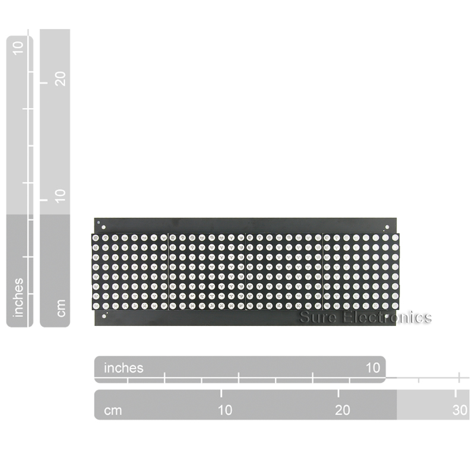
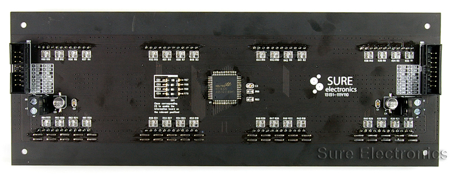

Horloge-Afficheur a matrice de led
===================================

Description
-----------

Le but de ce montage, c'est une horloge évoluée placée dans le salon qui permet d'afficher des informations supplémentaires comme la t° intérieure/extérieure, la pluviomètrie ou un message quelconque défilant.

Cette version utilise un  Afficheur SURE 32x8 piloté par un Arduino + Ethernet Schield ou Arduino Ethernet Pro

{width=400px height=400px}

[disp32x8udp.ino](src/disp32x8udp.ino)

---
*20/7/2014*
